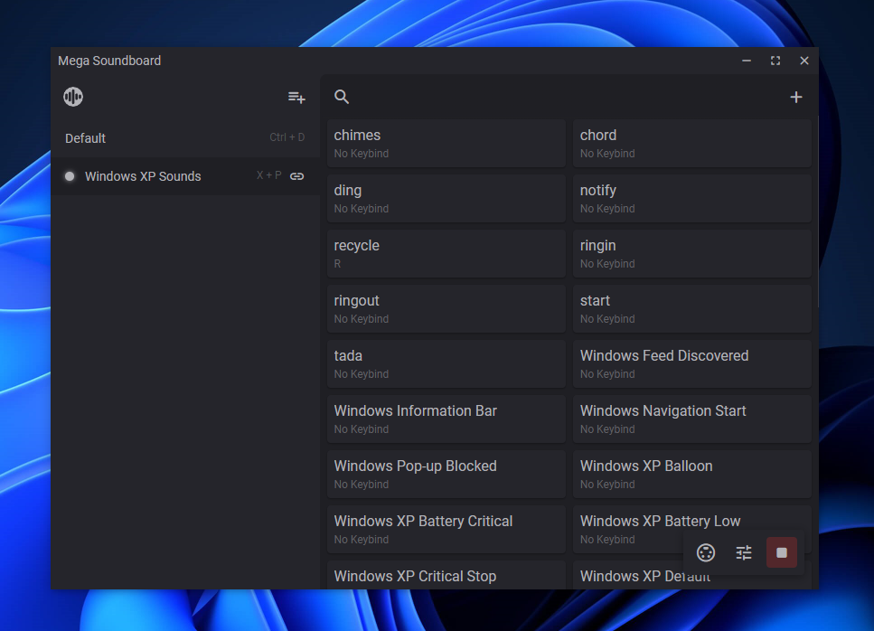
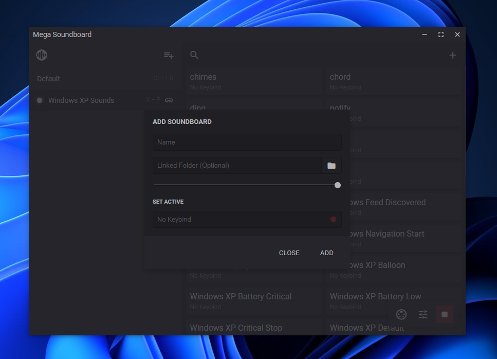
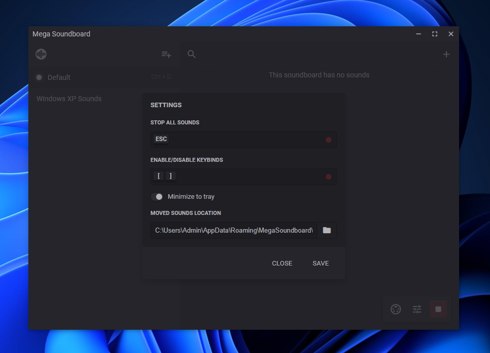
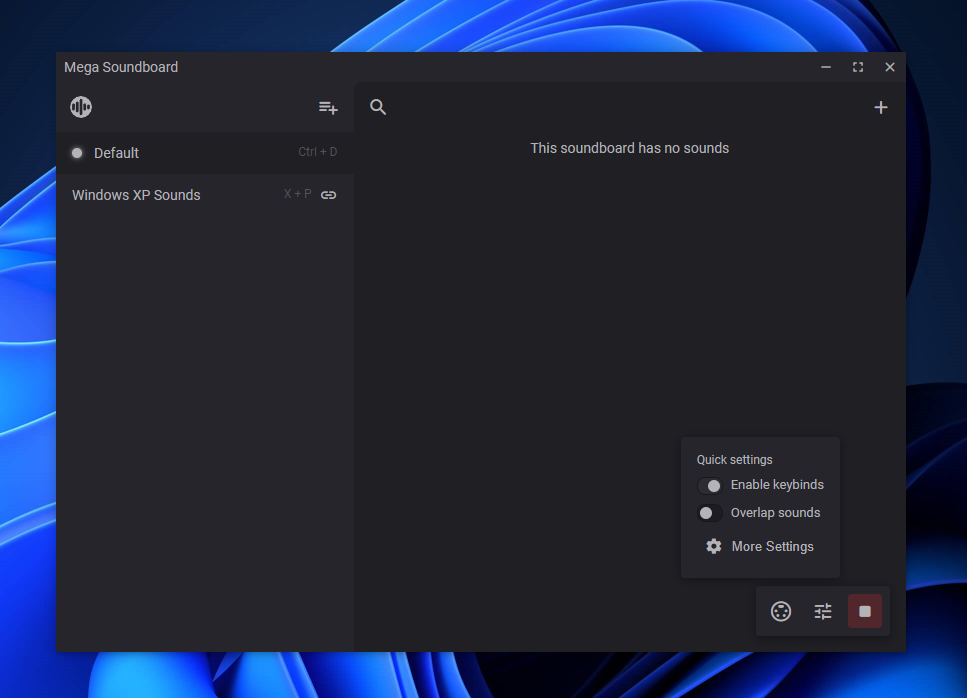
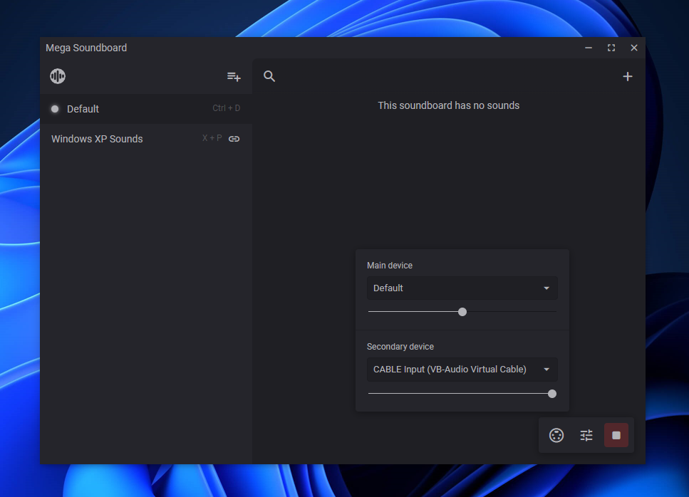

<!-- PROJECT LOGO -->

  
  <h3 align="center">Mega Soundboard</h3>

  

    Play and manage sounds with keybinds
     
    <a href="https://github.com/Tom4nt/Mega-Soundboard/releases">Download</a>
    ·
    <a href="https://github.com/Tom4nt/Mega-Soundboard/issues/new?assignees=Tom4nt&labels=BUG&projects=&template=bug_report.md&title=">Report a Bug</a>
    ·
    <a href="https://github.com/Tom4nt/Mega-Soundboard/issues/new?assignees=Tom4nt&labels=New+Feature&projects=&template=feature-request.md&title=">Request Feature</a>
  

---

Mega Soundboard is an app that allows you to organize sound files and play them to two output devices at the same time, optionally with keybinds.

## Main features
* Arrange sounds in soundboards and groups.
* Use global keybinds to switch to a different soundboard, play a sound/group, stop all sounds, disable/enable keybinds, and more.
* Play a random sound or group in a soundboard with a keybind.
* Decide what happens when you play a group: play all sounds at the same time, a random sound, or the next sound by the order defined by you.
* Configure volume per output device, soundboard, group and sound.
* Choose if sounds can overlap each other and if they loop. Both can be set with keybinds.
* Let Mega Soundboard virtually press a key (or keys) of your choice while a sound is playing. This is usefull for push-to-talk.
* Folder-linked Soundboards: Sounds can be synced between a folder on your system and a Soundboard. They are synced instantly and based on events (no polling).
* Move the source audio file to a specified folder before importing a sound.

## Screenshots

## Built With
* [Electron](https://www.electronjs.org/)
* [uiohook-napi](https://github.com/SnosMe/uiohook-napi/)

## Installation
Download a release of Mega Soundboard [here](https://github.com/Tom4nt/Mega-Soundboard/releases). Currently prebuilt only on Windows.

## Contributing
### Prerequisites
* npm
### Build and run
1. Clone repo
2. Install dependencies with `npm install`
3. Run with `npm run start`

## License
Distributed under the MIT License. [More information](https://github.com/Tom4nt/Mega-Soundboard/blob/master/LICENSE).
